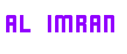

  

<!-- Social icons section -->

  
  &#8287;&#8287;&#8287;&#8287;&#8287;
  
  &#8287;&#8287;&#8287;&#8287;&#8287;
 
  &#8287;&#8287;&#8287;&#8287;&#8287;
 

 
## :chart_with_upwards_trend: Current Stats

 

## :computer: Technologies that I know

 
[]
[]
[]
[]
[]
[]
[]
[]
[]
[]
[]
[]

 

# MERN Stack Developer

Welcome to my GitHub profile! I'm a passionate Full-Stack Web Developer specializing in the MERN stack (MongoDB, Express.js, React.js, and Node.js). I enjoy building clean, efficient, and user-friendly web applications.

## About Me

I'm dedicated to building efficient and intuitive web solutions that meet client needs and exceed expectations. With a strong foundation in JavaScript and a keen eye for design, I enjoy crafting seamless user experiences and solving complex technical challenges.

## Skills

- **Frontend**: HTML, CSS, JavaScript, React.js, Bootstrap, Tailwind, Next.js.
- **Backend**: Node.js, Express.js, MongoDB, RESTful APIs
- **Database**: MongoDB, MySQL.
- **Tools & Technologies**: Git, GitHub, VS Code, npm, Firebase, Netlify, Figma

## Projects

Here are some noteworthy projects I've worked on:

1. **Tourist Web Site**

   - ✔ MongoDb CRUD operation
   - ✔ Implement json web token to secure API
   - ✔ Implement public and private routes.

2. **Institute Web Page**
   - ✔ Implement Public, Private routes using react router
   - ✔ Stored all data in mongoDB.
   - ✔ Login by email, google, github using firebase

## Contact Me

Feel free to reach out to me for collaboration opportunities or inquiries via-

- [Portfolio](https://alimran-portfolio.netlify.app/)
- [Email](mailto:mdalimransahin@gmail.com)
- [LinkedIn](https://www.linkedin.com/in/md-al-imran-3564692a2/)

Thank you for visiting my profile!

Keep coding! 🚀

Full-stack web developer
MERN-stack web developer
Experienced UI/UX Developer
3+ years of coding experience
Always learning new things
